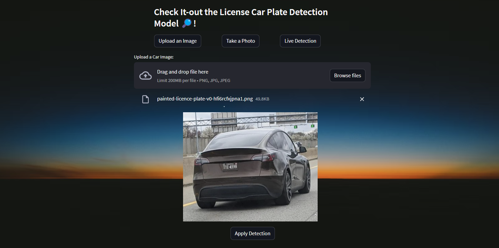
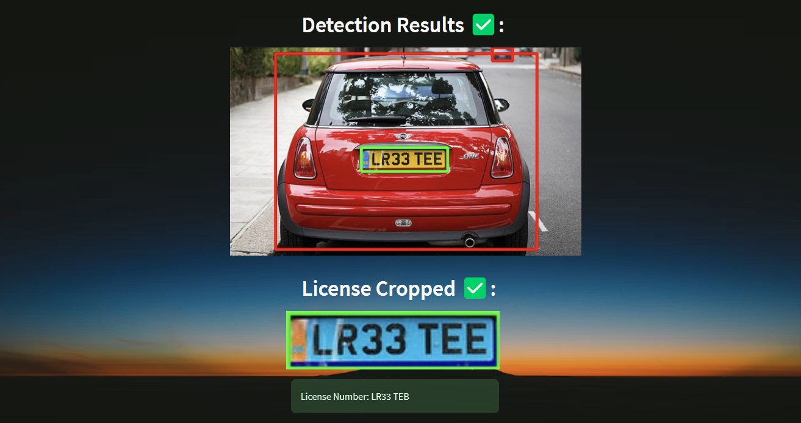

# License Plate Recognition 🚗


## License Plate Detection and Extraction with YoloV8 and EasyOCR

Using both the `COCO Model` to detect the vehicles and the `License Plate Model` to recognize the plate, and then with EasyOCR to extract the info from the cropped plate image.



## Check-it out
Test it by running the `app.py` file, built with `Streamlit`.

## Run
```sh
streamlit run app.py
```



## Resources
- Licenses Plates Dataset: https://universe.roboflow.com/roboflow-universe-projects/license-plate-recognition-rxg4e/dataset/4
